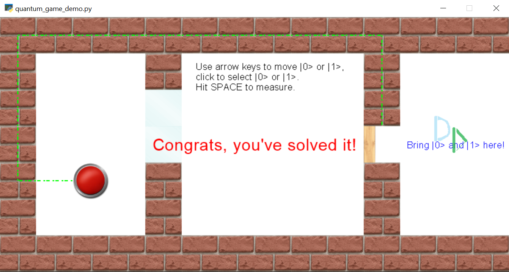
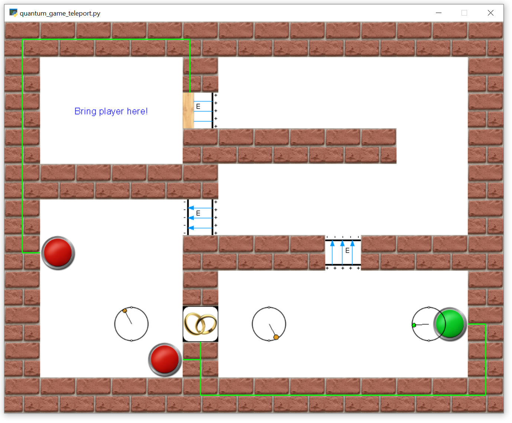

Simple Toy Quantum Games
------------------------

Basic quantum games implemented in Python / [Pyglet](http://pyglet.org).

To run the games, clone or download the repository, cd into the _code_ subfolder and run `python3 quantum_game_qubit.py` or `python3 quantum_game_teleport.py`.

Christian B. Mendl
